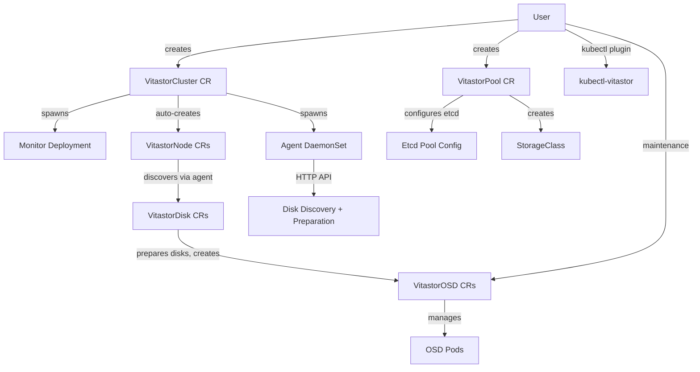

# Vitastor Operator v2 — Code Review & Improvement Plan

## Scope

Focused on v2 API only. Key areas: maintenance modes (noout/weight), pool lifecycle, disk manipulations, kubectl plugin, and critical bugs.

---

## Architecture Overview (from presentation)



**Only 2 CRDs are created manually**: VitastorCluster and VitastorPool.  
**3 CRDs are auto-managed**: VitastorNode, VitastorDisk, VitastorOSD.

---

## 1. Maintenance Modes — Critical Gaps

### 1.1 OSD noout is broken — uses `exec.Command` in controller pod

**File:** [`vitastorosd_controller.go`](internal/controller/vitastorosd_controller.go:264)

```go
func setNoout(osd *controlv2.VitastorOSD, value bool) error {
    osdId := strconv.Itoa(int(osd.Spec.Id))
    return exec.Command("vitastor-cli", "modify-osd", "--noout", strconv.FormatBool(value), osdId).Run()
}
```

`vitastor-cli` is NOT installed in the controller pod. This function silently fails. Per the presentation, noout should be controlled by editing `VitastorOSD.Spec.NoOut`.

**Fix:** Propagate noout via etcd directly. The OSD controller already has access to etcd config patterns. Write to `{prefix}/config/osd/{osd_id}` in etcd with `{"noout": true/false}`.

### 1.2 OSD noout is only used during rolling updates, not as a standalone feature

The `setNoout()` is called at [line 170](internal/controller/vitastorosd_controller.go:170) (before update) and [line 229](internal/controller/vitastorosd_controller.go:229) (after update), but:
- There is **no reconciliation of `Spec.NoOut`** — if a user sets `noout: true` on an OSD CR for maintenance, nothing happens.
- The return value of `setNoout()` is **ignored** at both call sites.

**Fix:** In the OSD reconcile loop, read `Spec.NoOut` and sync it to etcd on every reconcile.

### 1.3 OSD weight changes are never propagated

**File:** [`vitastorosd_controller.go`](internal/controller/vitastorosd_controller.go)

`VitastorOSD.Spec.Weight` is set to `"1"` on creation ([line 270](internal/controller/vitastordisk_controller.go:270)) but **no controller ever reads weight changes and pushes them to etcd**. Per the presentation, weight is the primary mechanism for data migration before maintenance.

**Fix:** Add weight reconciliation in the OSD controller. Write to `{prefix}/config/osd/{osd_id}` with `{"reweight": <value>}`.

### 1.4 OSD tags are never propagated

`VitastorOSD.Spec.Tags` exists in the spec but is never read by any controller. Tags should be written to etcd osd config for pool placement.

**Fix:** Include tags in the etcd osd config write along with noout and weight.

### 1.5 Node-level NoOut is never handled

**File:** [`vitastornode_controller.go`](internal/controller/vitastornode_controller.go)

`VitastorNodeSpec.NoOut` is defined but **never read** by the node controller. Per the presentation, setting noout on a node should set noout on all its OSDs for a quick reboot scenario.

**Fix:** When `VitastorNode.Spec.NoOut` changes, the node controller should list all VitastorOSD CRs owned by that node and set their `Spec.NoOut` accordingly. Alternatively, set noout at the node level in etcd.

### 1.6 Rolling update status case mismatch — updates never complete

**Files:** [`vitastorosd_controller.go:229`](internal/controller/vitastorosd_controller.go:229) vs [`vitastorcluster_controller.go:307`](internal/controller/vitastorcluster_controller.go:307)

- OSD controller sets `State = "running"` (lowercase)
- Cluster controller checks `State == "Running"` (uppercase)

The rolling update lock is **never released**, blocking all subsequent OSD updates across the cluster.

**Fix:** Define constants for OSD states: `OSDStateRunning`, `OSDStateUpdateRequired`, `OSDStateUpdating`.

---

## 2. Pool Lifecycle — Create/Modify/Delete

### 2.1 Pool deletion is completely broken — resources stuck forever

**File:** [`vitastorpool_controller.go`](internal/controller/vitastorpool_controller.go:102)

A `poolFinalizer` is added at [line 103](internal/controller/vitastorpool_controller.go:103) but there is **zero deletion handling**. When a VitastorPool is deleted:
- The pool entry stays in etcd forever
- The StorageClass is never cleaned up  
- The finalizer is never removed → resource is **stuck** and cannot be deleted

**Fix:** Add deletion logic before the main reconcile:
```go
if !vitastorPool.DeletionTimestamp.IsZero() {
    // 1. Delete pool entry from etcd pools map
    // 2. Delete associated StorageClass
    // 3. Remove finalizer
    controllerutil.RemoveFinalizer(&vitastorPool, poolFinalizer)
    return r.Update(ctx, &vitastorPool)
}
```

### 2.2 Missing pool config field mappings — incomplete etcd sync

**File:** [`vitastorpool_controller.go`](internal/controller/vitastorpool_controller.go:214)

The `VitastorPoolConfig` struct and `getPoolConfig()` method are missing these spec fields:

| Spec Field | Expected etcd key | Status |
|---|---|---|
| `LevelPlacement` | `level_placement` | ❌ Missing from struct AND mapping |
| `RawPlacement` | `raw_placement` | ❌ Missing from struct AND mapping |
| `LocalReads` | `local_reads` | ❌ Missing from struct AND mapping |
| `BitmapGranularity` | `bitmap_granularity` | ❌ Missing from struct AND mapping |
| `ScrubInterval` | `scrub_interval` | ❌ Missing from struct AND mapping |
| `OSDTags` | `osd_tags` | ⚠️ In struct but NOT in mapping |

### 2.3 Pool error return after StorageClass creation

**File:** [`vitastorpool_controller.go`](internal/controller/vitastorpool_controller.go:185)

```go
return ctrl.Result{Requeue: true}, err  // err is IsNotFound from Get
```

Should be `nil` — the `err` leaks from the prior `IsNotFound` check.

### 2.4 Pool status is never populated

`VitastorPoolStatus` has fields `Total`, `Used`, `Available`, `UsedPercent`, `Efficiency` but **no controller code** ever populates them. The pool status should be read from Vitastor's etcd stats.

### 2.5 StorageClass is never updated on pool modification

If a pool's spec changes (e.g., adding `vitastorFS`), the existing StorageClass is not updated. Only creation is handled, not reconciliation of existing SC parameters.

### 2.6 Unused parameter in getStorageClassConfig

**File:** [`vitastorpool_controller.go`](internal/controller/vitastorpool_controller.go:194)

`config *VitastorConfig` parameter is never used. Should either be removed or used to set `etcdUrl`/`configPath` in the StorageClass parameters.

---

## 3. Disk Manipulations — Issues

### 3.1 VitastorDisk namespace is always empty — controller broken

**File:** [`vitastordisk_controller.go`](internal/controller/vitastordisk_controller.go:82)

`VitastorDisk` is cluster-scoped (`+kubebuilder:resource:scope=Cluster`), so `disk.Namespace` is always `""`. This breaks:

- [`findAgentPod()`](internal/controller/vitastordisk_controller.go:166) — uses `client.InNamespace(namespace)` with `""` 
- [`ensureOSDCR()`](internal/controller/vitastordisk_controller.go:255) — creates OSD with empty namespace
- [`deleteOSDCR()`](internal/controller/vitastordisk_controller.go:287) — lists OSDs in empty namespace

**Fix:** Get the operator namespace from:
1. The VitastorCluster CR (via label `control.vitastor.io/cluster` → lookup → `.Spec.VitastorClusterNamespace`)
2. Or from the disk's labels / owner reference chain (Disk → Node → Cluster)

### 3.2 DesiredState enum typo

**File:** [`vitastordisk_types.go`](api/v2/vitastordisk_types.go:39)

```go
// +kubebuilder:validation:Enum=Discovered;Prepared;Dicommissioned;Unknown
```

`Dicommissioned` → `Decommissioned` (the controller uses `"Decommissioned"` at [line 151](internal/controller/vitastordisk_controller.go:151)).

### 3.3 Decommission doesn't migrate data first

**File:** [`vitastordisk_controller.go`](internal/controller/vitastordisk_controller.go:150)

When `DesiredState = "Decommissioned"`, the controller just deletes OSD CRs without:
1. Setting OSD weight to 0 first (to trigger data migration)
2. Waiting for data to drain
3. Actually purging OSD from etcd
4. Wiping the disk via agent

Per the presentation, the proper flow should be: set weight to 0 → wait for rebalance → remove OSD → wipe disk.

### 3.4 RBAC annotation wrong API group

**File:** [`vitastordisk_controller.go`](internal/controller/vitastordisk_controller.go:62)

```go
// +kubebuilder:rbac:groups=vitastor.io,resources=vitastorosds
```

Should be `groups=control.vitastor.io`.

### 3.5 Agent label mismatch — Node controller can never find agents

**File:** [`vitastornode_controller.go`](internal/controller/vitastornode_controller.go:198) vs [`vitastorcluster_controller.go`](internal/controller/vitastorcluster_controller.go:406)

- Cluster creates agents with: `"control.vitastor.io/app": "vitastor-agent"`
- Node controller looks for: `"app": "vitastor-agent"`

**Result:** Agent pods are never found → disks are never discovered → OSDs are never created.

### 3.6 `strings.Trim` misuse corrupts disk names

**Files:** [`vitastornode_controller.go`](internal/controller/vitastornode_controller.go:258) and [line 386](internal/controller/vitastornode_controller.go:386)

`strings.Trim("/dev/", disk.Name)` treats `/dev/` as a **character set**, stripping `/ d e v` from both ends. For `/dev/nvme0n1` this produces `nm0n1` instead of `nvme0n1`.

**Fix:** `strings.TrimPrefix(disk.Name, "/dev/")`

---

## 4. Other Controller Bugs

### 4.1 Nil Annotations map panic in OSD pod creation

**File:** [`vitastorosd_controller.go`](internal/controller/vitastorosd_controller.go:191)

Pod is created without initializing `Annotations` map → writing to nil map → **panic**.

### 4.2 Label typo in OSD pod

**File:** [`vitastorosd_controller.go`](internal/controller/vitastorosd_controller.go:57)

`"control.vitator.io/disk"` — missing `s`, should be `"control.vitastor.io/disk"`.

### 4.3 Resource comparison on PodSpec level instead of Container level

**File:** [`vitastorcluster_controller.go`](internal/controller/vitastorcluster_controller.go:173)

`Spec.Template.Spec.Resources` is pod-level resources, not container resources. Should be `Spec.Template.Spec.Containers[0].Resources`.

### 4.4 Node controller uses global `http.Get()` instead of `r.HttpClient`

**File:** [`vitastornode_controller.go`](internal/controller/vitastornode_controller.go:214)

Uses default HTTP client with no timeout. Should use `r.HttpClient`.

### 4.5 Unchecked `json.Unmarshal` error

**File:** [`vitastornode_controller.go`](internal/controller/vitastornode_controller.go:224)

Error from `json.Unmarshal(body, &systemDisks)` is silently swallowed.

### 4.6 Duplicated placement level code in node controller

The etcd GET → unmarshal → modify → marshal → PUT pattern for `node_placement` is copy-pasted **3 times** in the same function. Should be extracted to a helper like `updatePlacementLevel(ctx, cli, path, key string, placement VitastorNodePlacement)`.

### 4.7 Dead v1 code in node controller

**File:** [`vitastornode_controller.go`](internal/controller/vitastornode_controller.go:400)

`getConfiguration()` returns `controlv1.VitastorOSD` and is never called. Remove along with the `controlv1` import.

---

## 5. V2 API Type Improvements

### 5.1 Add printer columns for kubectl output

Currently `kubectl get` shows only NAME and AGE. Proposed columns:

**VitastorPool:**
```go
// +kubebuilder:printcolumn:name="Scheme",type=string,JSONPath=`.spec.scheme`
// +kubebuilder:printcolumn:name="PG Size",type=integer,JSONPath=`.spec.pgSize`
// +kubebuilder:printcolumn:name="PG Count",type=integer,JSONPath=`.spec.pgCount`
// +kubebuilder:printcolumn:name="ID",type=integer,JSONPath=`.status.id`
// +kubebuilder:printcolumn:name="Used%",type=string,JSONPath=`.status.usedPercent`
```

**VitastorOSD:**
```go
// +kubebuilder:printcolumn:name="ID",type=integer,JSONPath=`.spec.id`
// +kubebuilder:printcolumn:name="State",type=string,JSONPath=`.status.state`
// +kubebuilder:printcolumn:name="NoOut",type=boolean,JSONPath=`.spec.noout`
// +kubebuilder:printcolumn:name="Weight",type=string,JSONPath=`.spec.weight`
```

**VitastorNode:**
```go
// +kubebuilder:printcolumn:name="NoOut",type=boolean,JSONPath=`.spec.noout`
// +kubebuilder:printcolumn:name="Weight",type=string,JSONPath=`.spec.weight`
```

**VitastorDisk:**
```go
// +kubebuilder:printcolumn:name="Node",type=string,JSONPath=`.spec.nodeRef`
// +kubebuilder:printcolumn:name="Device",type=string,JSONPath=`.spec.devicePath`
// +kubebuilder:printcolumn:name="State",type=string,JSONPath=`.status.state`
// +kubebuilder:printcolumn:name="Type",type=string,JSONPath=`.status.type`
```

**VitastorCluster:**
```go
// +kubebuilder:printcolumn:name="Monitors",type=integer,JSONPath=`.spec.monitor.replicas`
// +kubebuilder:printcolumn:name="Node Label",type=string,JSONPath=`.spec.vitastorNodeLabel`
```

### 5.2 Add `+kubebuilder:storageversion` to VitastorDisk

Missing from [`vitastordisk_types.go`](api/v2/vitastordisk_types.go:72).

### 5.3 Fill in sample YAMLs

All v2 sample manifests are empty `# TODO` placeholders.

---

## 6. kubectl Plugin Design

Based on the presentation, the plugin needs these commands:

### Commands

```
kubectl vitastor status                                    # Cluster overview
kubectl vitastor disk list [--node=<node>]                 # List disks
kubectl vitastor disk prepare <node> <disk> [--osd-per-disk N]  # Prepare disk for OSD
kubectl vitastor disk remove <node> <disk>                 # Decommission disk
kubectl vitastor osd list [--node=<node>]                  # List OSDs  
kubectl vitastor osd noout <osd-name> [true|false]         # Toggle noout
kubectl vitastor osd weight <osd-name> <value>             # Set weight
kubectl vitastor node list                                 # List vitastor nodes
kubectl vitastor node noout <node-name> [true|false]       # Toggle node noout
kubectl vitastor pool list                                 # List pools with stats
```

### Architecture

```
plugin/
  go.mod
  go.sum  
  main.go                  # Entry: installs as kubectl-vitastor
  cmd/
    root.go                # Root cobra command
    status.go              # kubectl vitastor status
    disk.go                # kubectl vitastor disk list/prepare/remove
    osd.go                 # kubectl vitastor osd list/noout/weight  
    node.go                # kubectl vitastor node list/noout
    pool.go                # kubectl vitastor pool list
  pkg/
    kube/
      client.go            # K8s client with v2 CRD scheme
    output/
      table.go             # Table formatting for terminal output
```

### How commands work

| Command | Action |
|---|---|
| `status` | List VitastorCluster, count nodes/disks/OSDs/pools, show conditions |
| `disk list` | List VitastorDisk CRs, show node/device/state/type |
| `disk prepare` | Patch VitastorDisk CR: set `desiredState: Prepared` and optionally `desiredOSDCount` |
| `disk remove` | Patch VitastorDisk CR: set `desiredState: Decommissioned` |
| `osd list` | List VitastorOSD CRs, show id/state/node/weight/tags |
| `osd noout` | Patch VitastorOSD CR: set `spec.noout` |
| `osd weight` | Patch VitastorOSD CR: set `spec.weight` |
| `node list` | List VitastorNode CRs with status |
| `node noout` | Patch VitastorNode CR: set `spec.noout` |
| `pool list` | List VitastorPool CRs with status stats |

The plugin only patches CRs — the actual operations are performed by the controllers reacting to spec changes.

---

## 7. Implementation Plan

### Phase 1 — Critical Fixes
1. Fix `strings.Trim` → `strings.TrimPrefix` in node controller
2. Fix nil Annotations map panic in OSD controller
3. Fix OSD status case mismatch (define state constants)  
4. Fix label typo `control.vitator.io` in OSD controller
5. Fix agent label mismatch between cluster and node controllers
6. Fix VitastorDisk namespace for cluster-scoped resources
7. Fix RBAC group in disk controller

### Phase 2 — Maintenance Mode Implementation
8. Replace `setNoout()` exec.Command with etcd-based approach
9. Add noout spec reconciliation in OSD controller (sync to etcd)
10. Add weight spec reconciliation in OSD controller (sync to etcd)
11. Add tags spec reconciliation in OSD controller (sync to etcd)
12. Add node-level NoOut handling (propagate to OSDs)

### Phase 3 — Pool Lifecycle Completion
13. Add pool deletion handler (remove from etcd, cleanup SC, remove finalizer)
14. Add missing field mappings to VitastorPoolConfig and getPoolConfig
15. Fix error return after StorageClass creation
16. Add pool status population from etcd stats
17. Add StorageClass update on pool modification
18. Remove unused config parameter from getStorageClassConfig

### Phase 4 — Disk Lifecycle Improvements
19. Implement proper decommission flow: weight 0 → drain → remove → wipe
20. Fix DesiredState enum typo in VitastorDisk types

### Phase 5 — V2 API Polish
21. Add printer columns to all v2 types
22. Add storageversion marker to VitastorDisk
23. Fill in sample YAML manifests
24. Remove dead v1 code from node controller

### Phase 6 — Code Quality
25. Fix resource comparison level in cluster controller
26. Fix http.Get → r.HttpClient in node controller
27. Fix unchecked json.Unmarshal error  
28. Extract duplicated placement level update code
29. Regenerate CRDs and deploy manifests

### Phase 7 — kubectl Plugin
30. Scaffold plugin with cobra, go.mod dependencies
31. Implement K8s client setup with v2 CRD scheme
32. Implement `kubectl vitastor status`
33. Implement `kubectl vitastor disk list/prepare/remove`
34. Implement `kubectl vitastor osd list/noout/weight`
35. Implement `kubectl vitastor node list/noout`
36. Implement `kubectl vitastor pool list`
37. Add Makefile target for plugin build
38. Add table output formatting

### Phase 8 — Tests
39. Update all tests to use v2 types
40. Add meaningful test cases for key reconciliation paths
